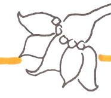

### Teil e) von [Besprechung Sa, 01.12.2018, 10:30-14:30: CD, PC, MK](Besprechung_2018-12-01.md) ###
*(Legende: siehe [Besprechung_2018-06-29](Besprechung_2018-06-29.md))*

---
Vorbemerkung: die neuen Vorlagen vom 12.12. sind nahezu perfekt, und setzen eigentlich schon alle Punkte um. Das folgende soll als Dokumentation und Referenz dienen.

---

#### e) Hefte - Anforderungen an Scanvorlagen ####
Diskutiert anhand der Originale für Elfchen vom 17.11.2018, Beispielbilder auch aus neuem Innencover ("Dieses Heft gehört").

Grundsätzlich gilt für den Bearbeiter (MK): unterscheide zwischen vom Künstler (PC) *beabsichtigten* Effekten einerseits und *unbeabsichtigten bzw. versehentlichen* Effekten andererseits. Es schadet also nicht, dergleichen irgendwie explizit zu machen bzw. zu diskutieren.

Damit wir überhaupt darüber reden können, müssen wir erst *differenzieren* und dann *benennen*.
Im Folgenden sei also von einzelnen "Mitteln" die Rede, jedes davon mit eigenem Namen.
Ausdrücklich: es sind **nur Namen, ohne jegliche Wertung**. Alternative Benennungen sind jederzeit willkommen.

Es geht hier also **nicht um künstlerische/ästhetische Kritik**.

Wir wollen durchaus einen "handgemachten" Charakter erreichen; die Hefte sollen *nicht* zu "clean" sein - gleichzeitig aber auch nicht dilettantisch wirken.
Damit ist zunächst *jedes* der unten genannten Mittel potentiell geeignet, dieses Ziel zu erreichen. Die eigentliche Aufgabe besteht darin, sie jeweils an der richtigen Stelle und in der passenden Dosierung anzuwenden. 

* "Fehlstriche": meint sowohl ein "Zuviel" als auch ein "Zuwenig" an schwarzer Linie (Tusche):
  -  versus 
  - am oberen Blütenblatt: ein "Zuviel", das entfernt wurde
  - bei den teilweise nicht geschlossenen "Kringeln": ein "Zuwenig", das absichtlich beibehalten wurde
* "Übermalung": schwarze (Begrenzungs-) Linie mit Farbe/Buntstift übermalt:
  -  versus 
  - Der Schriftzug ist links (unbearbeitet) wie rechts exakt gleich hell (sic!). Rechts ist aber die Schrift reines Grau (keinerlei Farbanteil), während wir links verschiedene dunklere Orange-Töne haben. Kann beabsichtigt sein - oder auch nicht...  
* "Fehlkolorierung": ein "Zuviel" oder "Zuwenig" von Farbe/Buntstift bzgl. schwarzer (Begrenzungs-) Linie:
  -  versus 
  - wieder *nur* zur Illustration: rechts wurden beide Arten von Fehlkolorierung entfernt.
  Ob - und wenn ja inwiefern - das nun besser oder schlechter wäre, darum soll's hier nicht gehen.
* "Farbgebung": wie satt / knallig (oder eben nicht) sollen die Farben (auch: relativ zueinander) sein? 

Probleme:

- Übung "Einzelworte nachschreiben":
  Die Linien wurden ausgedruckt, dann darauf die Vorgabeworte geschrieben. Das ist an sich eine gute Idee, **aber** es ist ein ganz feines Punktmuster mitgedruckt worden. Das stört beim nochmaligen Einscannen.
- Titelseite:
  * Beim "Hochziehen" der Farben am Computer ist die Schrift "abgesoffen". Grund: Linien liegen *nicht* getrennt von Kolorierungen vor. 
  * Beschnittrand war nicht berücksichtigt, Bsp. "Petra Cordua" ganz am oberen Rand. Dies ließ sich noch korrigieren, dergl. ist aber in größerem Stil nicht machbar. 
  * Layoutänderungen wie Zentrieren von Schriftzügen oder gar Verschieben von Bildelementen wie z.B. den "Problemchenblasen" praktisch unmöglich

Vorgehen:

- *Einzelne Elemente* scannen und erst am Computer platzieren bzw. übereinanderlegen. Stichwort: **"Collage"**.
- Linien bzw. Schrift am besten in sattem Schwarz (Fineliner oder Füller/Tusche). Das lässt sich am besten "freistellen" (= vom irrelevanten Rest trennen). Effekte wie "heller", "mit Buntstift übermalt" und sogar "Bleistift" lassen sich dann leicht am Computer erzielen.
- Die einzelnen Elemente am besten *vollständig* zeichnen, selbst wenn sie sich im Endergebnis überlappen, d.h. Teile nicht mehr sichtbar sein werden. Das ist der effektivste Weg, um maximale Freiheit bei der Anordnung der Elemente zu erreichen.
- Kolorierung machen wir auch separat -> Schraffuren, Farbflächen *ohne* Tuschelinien
