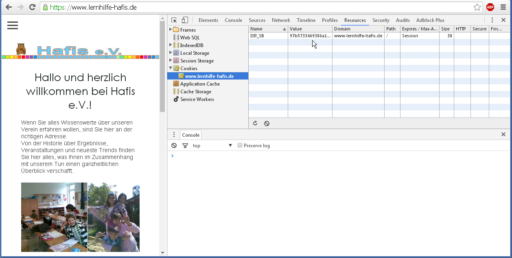
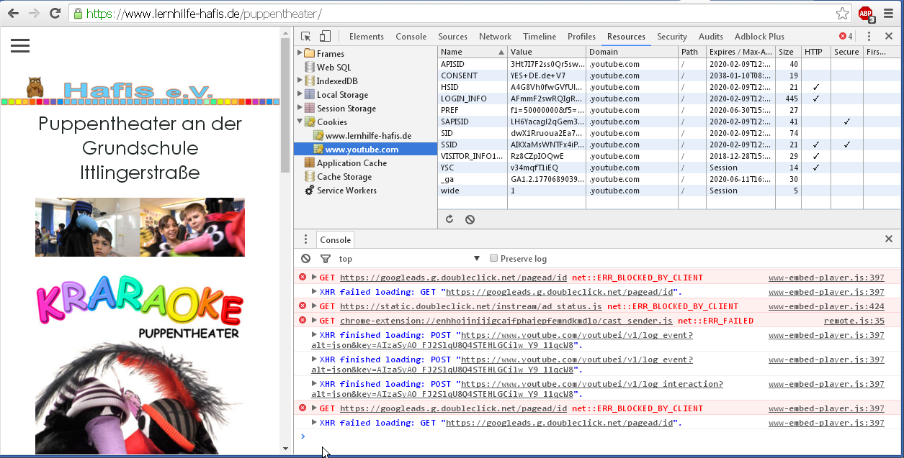

### DSGVO allgemein ###
  * Das Gesetz selbst: [dsgvo-gesetz.de](https://dsgvo-gesetz.de)

  * ["Was sind personenbezogene Daten?"](https://hosting.1und1.de/hilfe/datenschutz/allgemeineinformationen/datenschutz-grundverordnung-dsgvo-im-ueberblick/?utm_campaign=1788&utm_content=direct&utm_medium=landinghub&utm_source=helpcenter&utm_term=1795)[1&1]. Deckt sich nicht ganz mit der Formulierung *"Personenbezogene Daten sind Daten über Ihre Person. Diese beinhalten Ihren Namen, Ihre Adresse und Ihre Email Adresse"*. 

  * Guter Artikel: [Datenschutz-Grundverordnung (DSGVO) Zusammenfassung und Checkliste](https://hosting.1und1.de/digitalguide/websites/online-recht/datenschutz-grundverordnung-regeln-fuer-unternehmen/)
	```
		
		Datenschutzbeauftragte: Für viele Unternehmen ist ein Datenschutzbeauftragter
		fortan	Pflicht. Dieser überwacht die individuell ausgearbeitete Datenschutz-
		strategie und die DSGVO/GDPR-Konformität.
		Das betrifft nicht bloß Unternehmen, die in großem Umfang mit personenbezogenen
		Daten arbeiten. Jedes Unternehmen, bei dem mehr als 10 Personen regelmäßig mit
		personenbezogenen Daten zu tun haben, muss künftig einen Datenschutzbeauftragten
		bestellen.

	```
	- -> ich kann mir nicht vorstellen, wie das auf den e.V. zutreffen sollte.
	- außerdem: die DSGVO regelt datenschutzrechtliche *Grundsätze*; Cookies und User-Tracking werden detailliert erst in der [E-Privacy-Verordnung der EU](https://hosting.1und1.de/digitalguide/websites/online-recht/eprivacy-verordnung/) geregelt, und zwar frühestens 2019.
    - Zitat: *"Daher ist es derzeit zu früh, sich konkrete Gedanken über die E-Privacy-Verordnung zu machen – vor 2019 wird diese Verordnung wohl nicht wirksam. **Dennoch sollten Webseitenbetreiber und Onlinehändler die E-Privacy-Verordnung unbedingt im Blick behalten.**"*
    >

  * [Checkliste speziell für 1&1 Kunden](https://hosting.1und1.de/hilfe/datenschutz/allgemeineinformationen/checkliste/) [TODO]

### Cookies ###
  * eine vorbildliche Cookie-Informationsseite mit opt-out ist [die entsprechende Seite von 1&1 selber](https://hosting.1und1.de/cookies)

  * [github.com/creativeaura/eu-cookie-opt-in](https://github.com/creativeaura/eu-cookie-opt-in)

  * [www.450heartbeats.com/tutorials/opt-out-cookie-google-analytics-daten-erfassung-deaktivieren](https://www.450heartbeats.com/tutorials/opt-out-cookie-google-analytics-daten-erfassung-deaktivieren)

  * **[Google DoubleClick](https://www.doubleclickbygoogle.com/de/)** braucht man um Werbeanzeigen zu schalten. Es ist recht umstritten: *"DoubleClick has also been criticized for misleading users by offering an opt-out option that is effectively useless"* [[Wikipedia](https://en.wikipedia.org/wiki/DoubleClick)]. Wahrscheinlich deshalb taucht das im Zusammenhang mit DSGVO immer auf.

  * **Eingebettete Youtube-Videos führen zu einer Kontaktaufnahme mit Google Doubleclick** (siehe unten)

  * 1&1 WebAnalytics (haben wir) **ist nicht dasselbe** wie Google Analytics (haben wir *nicht*)
  * [laut 1&1 WebAnalytics benutzt *keine Cookies*](https://hosting.1und1.de/hilfe/datenschutz/datenverarbeitung-von-webseitenbesuchern-ihres-11-produktes/11-webanalytics/?utm_campaign=1788&utm_content=direct&utm_medium=landinghub&utm_source=helpcenter&utm_term=2103) - aber: es basiert offensichtlich auf Snowplow Analytics...?

  * [MyWebsite verwendet Cookies (Snowplow)](https://hosting.1und1.de/hilfe/datenschutz/datenverarbeitung-von-webseitenbesuchern-ihres-11-produktes/11-mywebsite-aktuelles-produktangebot/?utm_campaign=1788&utm_content=direct&utm_medium=landinghub&utm_source=helpcenter&utm_term=2423). Tatsächlich scheint es nur ein einziges zu sein: 

  * [Abschnitt zu Snowplow einfügen?](https://hosting.1und1.de/hilfe/datenschutz/datenverarbeitung-von-webseitenbesuchern-ihres-11-produktes/11-mywebsite-aktuelles-produktangebot/?utm_campaign=1788&utm_content=direct&utm_medium=landinghub&utm_source=helpcenter&utm_term=2423)

  * In der Eklärung, Abschnitt **Cookies**: *"Lediglich die Internet Protokoll Adresse wird hierbei gespeichert – keine personenbezogenen Daten."* Das mit der IP-Adresse ist Blödsinn. Es kann zwar nicht viel in einem Cookie gespeichert werden, abgesehen davon aber beliebige Daten, was immer der Server will. Gut erklärt auf der erwähnten [Cookie-Infoseite von 1&1](https://hosting.1und1.de/cookies)

  * In der Erklärung, Abschnitt **Cookies**: *"Wenn Sie die Verwendung von Cookies ablehnen, kann es jedoch zu Einschränkungen in der Nutzung mancher Bereiche unserer Internetseiten kommen."* - **Ist nicht der Fall.**

### Logs ###
  * in der Eklärung heißt es *"Lediglich im Rahmen unserer Serverstatistik, die wir alle zwei Jahre in unserem Tätigkeitsbericht veröffentlichen, findet eine Darstellung der Anzahl der Seitenaufrufe statt."* **Stimmt das?**

  * 1&1: [Die Server-Logs gehen max. 21 Tage zurück](https://hosting.1und1.de/hilfe/datenschutz/datenverarbeitung-von-webseitenbesuchern-ihres-11-produktes/11-webhosting/?utm_campaign=1788&utm_content=direct&utm_medium=landinghub&utm_source=helpcenter&utm_term=2176). In der Erklärung steht nur was komisches über "Anonymisierung der IP-Adresse nach 7 Tagen". Technisch gibt das wenig Sinn, ich kann nur raten was wohl gemeint sein könnte. **Ich glabue aber nicht, dass 1&1 das so macht.** Sie nutzen die IP-Adressen um den Standort der Besucher (grob) zu bestimmen. [TODO: wo hab ich das gelesen?]

### Videos einbetten ###
  * (Original) heise-Artikel: [YouTube-Videos datenschutzkonform einbetten](https://www.heise.de/ct/ausgabe/2016-1-YouTube-Videos-datenschutzkonform-einbetten-3046316.html). Der Anwalt hat den i.W. abgeschrieben, gibt aber die Quelle an. Ich selbst komme zu etwas anderen Schlüssen als der Anwalt.

  * https://www.450heartbeats.com/tutorials/wordpress/datenschutzkonformes-einbetten-von-youtube-videos

  * **auch im sog. erweiterten Datenschutzmodus wird Doubleclick kontaktiert**, selbst wenn das Video gar nicht angesehen wird. Derzeit (wohl ohne "erw. Datenschutzmodus") sieht das dann so aus: . Die roten Zeilen sind Anfragen an doubleclick.net (die mein Adblocker unterbunden hat).

  * YT / erw. Modus: [support.google.com/youtube/answer/171780?expand=PrivacyEnhancedMode#privacy](https://support.google.com/youtube/answer/171780?expand=PrivacyEnhancedMode#privacy)

  * es gibt **Alternativen** zu Youtube, z.B.: **[Vimeo](https://vimeo.com/de/upgrade)**. Das ist werbefrei (keine Werbeeinblendungen vor/hinter/im Video) und für Deine Zwecke auch kostenlos. [Vimeos Cookierichtlinie](https://vimeo.com/cookie_policy?vcid=32179)

  * Beispiel-Code um den [Vimeo-Player einzubetten](https://github.com/vimeo/vimeo-oembed-examples/tree/master/oembed)

  * oder per `<iframe>`: klicke auf "Teilen" bei irgendeinem Video bei Vimeo
