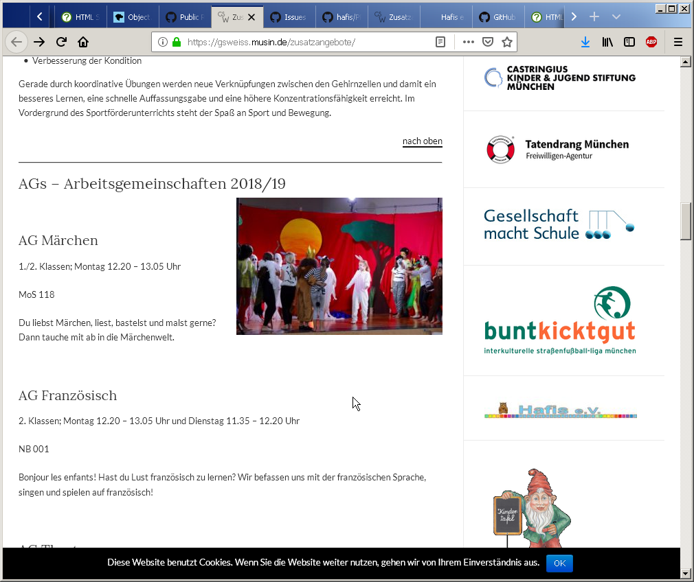
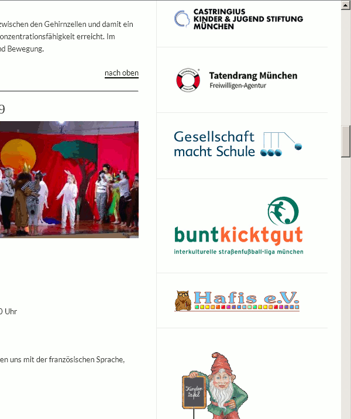

### Übersicht neue Logos in klein ###

#### `Logo_Hafis-2016_klein-Weissensee.jpeg` ####

Der status quo, zum Vergleich.

----

#### `Logo_Hafis-2016_221x32.png` ####

Exakt gleiches Layout, in besserer Qualität. 
	
----

#### `Logo_Hafis-2018_01-klein.png` ####

Layout i.W. gleich, aber vorgegebenen Platz besser genutzt.

----

#### `Logo_Hafis-2018_02a-klein.png` ####

Andere Anordnung, besserer Farbverlauf.

----

#### `Logo_Hafis-2018_02b-klein.png` ####

Wie 2a + Eule größer und leichter 3D-Effekt für die Kästchen.

----

#### `Logo_Hafis-2018_02c-klein.png` ####

Wie 2b + neues Element "Grundlinie": wie die Linien in einem Grundschul-Schreibheft. 

----

#### `Logo_Hafis-2018_03c-klein(Jasmine-UPC-Bold).png` ####
.png)

Wie 2c, mit neuer Schrift.

Dies wäre eigentlich mein Favorit, ist aber unfertig.
Außerdem ist der Schritt zu einer neuen Schrift einer,
der wohlüberlegt sein will.
Und dann natürlich auch auf www.lernhilfe-hafis.de gemacht werden muss. 

TODOs:

* Umrandung der Schrift ist deutlich zu heftig
* was vorher zu dick war ist hier zu dünn: bei "a", "s" und "e"
* "e.V." noch genauso groß wie "Hafis". Das kleiner zu machen ist eine gute Idee, die wir beibehalten sollten. Immerhin sind Zeichenabstand und Unterschneidungen schon gut.

----

#### screenshots Weissensee-HP ####

Zum Vergleich im Kontext zwei screenshots (status-quo vs. 03c):

 