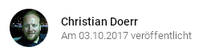

## Status quo Dez. 2018 ##

### Übersicht / Quellen ###
* 1&1/IONOS, MyWebsite-Editor unter `Einstellungen | Bilder` (im repo: [`/MyWebsite/Bilder/`](../../MyWebsite/Bilder/))
  - `Logo_Hafis-2016_HP-Titel.jpg` [`logo-2016-j.jpg` = `logo-2016-capital-J.jpg`]
  - `Eule-2016_anim.gif` [`ggEule.gif`]
  - `Eule-2016_192x128.png` [`Eule192x128.png`]
* email
  - `Logo_Hafis-2016_mail-2018-11-22.gif` [`logo.gif`]
* [Homepage der Grundschule an der Weißenseestraße](https://gsweiss.musin.de/zusatzangebote) (aka "Weissensee-HP")
  - `Logo_Hafis-2016_klein-Weissensee.jpeg`
* Kruno-Stick (erhalten 2018-12-01) - **Bingo!**:
  Auf diesem Stick fanden sich neben Daten zu Deutschheft1 auch zwei Ordner, die u.a. Logos bzw. Elemente davon enthalten (hier nur Logo-Relevantes):
  - [`Kruno-Stick/WEB2016/`]
    * `logo-2016.png`
    * `logo-2016.psd` <<<<<<< !
    * `logo-2016-J.jpg` = `Logo_Hafis-2016_HP-Titel.jpg`
    * [`grafik/`]
      - `buttons_133b.gif`
      - `buttons_133w.gif`
      - `buttons_22q.gif`
      - `logo.gif` = `Logo_Hafis-2016_mail-2018-11-22.gif`
      - `logocubline.gif`
      - `logograph2010.gif`
  - TODO: [`Kruno-Stick/FLYER/...`]
* Profil chdoerr auf github.com (nur der Vollständigkeit halber; Profilbild aus vorhandenem Material)
  - `Avatar_chdoerr@github-(Eule-2016)_70x70.png`
* [Youtube-Kanal "Christian Doerr"](https://www.youtube.com/channel/UC8E3QP7VHt7u6CBszPK8miA) (dort ist das Video vom Puppentheater)
  - Profilbild `Avatar_Christian-Doerr@Youtube-(Selfie)_288x288.jpg`

### Vorhandenes Material ###

#### `Logo_Hafis-2016_HP-Titel.jpg` ####
Derzeit auf der [Homepage verwendet](https://www.lernhilfe-hafis.de/s/img/logo-2016-j.jpg), also in [`/MyWebsite/Bilder/Logo/`](../../MyWebsite/Bilder/Logo/).

* Herkunft: `logo-2016-j.jpg`, bzw. *identisch* `logo-2016-capital-J.jpg` in [`/MyWebsite/Bilder/`](../../MyWebsite/Bilder/)
* Außerdem *identisch* mit `Kruno-Stick/WEB2016/logo-2016-J.gif` - anscheinend stehen "-j", "-capital-J" und "-J" einfach nur für "jpg"...
* Dateiformat `.jpg` ungeeignet - Artefakte. Insbesondere in der Eule. Aber auch alle anderen Flächen (Farbkästchen, Schriftfüllung und Hintergrund) sind nicht homogen -> Freistellen erschwert.
* Format 880 x 129 px @ 300 x 300 dpi, tatsächlicher Inhalt 878 x 89 px
  - horizontal nicht exakt zentriert: weißer Rand links von 2 px
  - weisser Rand oben 31 px und unten 9 px, vmtl. zur Positionierung auf HP (sollte man anders lösen)
  - Eule: 53 x 67 px
  - "Hafis e.V.": 469 x 49 px
* Gestaltung:
  - Schrift ist ungefähr zentriert, dann die Eule links danebengesetzt. Dadurch mehr weisser Platz rechts.
  - der Farbverlauf unter der Schrift (aber nur bis Mitte "V") ist durch eine Strecke einheitlich hellblau unterbrochen - warum?
  - der Farbverlauf enthält scheinbar 11 (tatsächlich 10, s.u) Farben aus dem gesamten Farbkreis, allerdings *nicht* in gleichen Abständen von 360° / 12 = 30°. Das Hellblau der Schrift liegt bei 200° Hue (Saturation = Value = 100%), das Orange der Umrandung ist mit 20° (S = 75%, V = 80%) die Komplementärfarbe vom hellblau. In der linken Wiederholung vom Verlauf fehlt das helle türkis 150° / 40% / 100% (unter "V" und "."), sie beginnt mit 150° / 80% / 100%...? 
  - Schrift ist extrem fett und zusätzlich in die Breite gezogen, dadurch - selbst in dieser Größe (!) -
    * bilden "f" und "i" fast eine Ligatur
    * wäre das "e.V." vmtl. zu prominent gekommen, deshalb kleinere Schriftgröße, s.d. das große "V" so hoch wie ein Kleinbuchstabe vom Rest ist. Dies wiederum bewirkt, dass beim "e" praktisch kein Hohlraum mehr zu sehen ist. 

---

#### `Logo_Hafis-2016_klein-Weissensee.jpeg` ####

* Herkunft: [Weissensee-HP](https://www.lernhilfe-hafis.de/s/img/logo-2016-j.jpg) (Bild-URL: https://gsweiss.musin.de/wp-content/uploads/2018/12/Hafis-e.V.-logo-2016-j-e1544036687234.jpeg).
  Offensichtlich einfach eine schlecht skalierte Version von obigem `Logo_Hafis-2016_HP-Titel.jpg`; erstellt Anfang Dez. 2018 von jemand bei der Weissensee-GS (vermutet aufgrund Bild-URL).
* Format: 222 x 33 px @ 96 dpi, tatsächlicher Inhalt 222 x 23 px
* Insbesondere das Ziel neben anderen Logos auf der Weissensee-HP wenigstens nicht negativ aufzufallen ist *eindeutig verfehlt*. TODO: screenshot
* Anordnung der Elemente für dieses kleine Format ungeeignet:
  - Farbbalken unnötig lang (-> lange Strecke Hellblau...)
  - dadurch (und die vorgegebene max. Breite) ist die Eule so klein, dass man sie ohne Vorwissen nicht mehr als solche erkennen kann.
  - Details des Schriftzugs, insbesondere Hohlräume in "a" und "e" sowie der Punkt über dem "i" nur noch wage zu erahnen.

---

#### `Logo_Hafis-2016_mail-2018-11-22.gif` ####

* Herkunft: mail "besseres Logo" von @chdoerr an @meisl vom 22. Nov. 2018; Name dort schlicht `logo.gif`
* *Identisch* mit `Kruno-Stick/WEB2016/grafik/logo.gif`
* Format: 726 x 95 px @ 300 x 300 dpi, tatsächlicher Inhalt: 709 x 78 px
* durch Dateiformat `.gif` keine Artefakte, homogene Flächen
* Gestaltung im Vergleich zu `Logo_Hafis-2016_HP-Titel`:
  - statt Farbbalken das Akronym "Hafis" ausgeschrieben: "Hausaufgabenbetreuung für internationale Schüler"
  - Eule exakt gleich gross: 53 x 67 px hoch
  - Schrift praktisch gleich groß: 470 x 48 statt 468 x 49 (+/- Artefakte im jpg)
  - Eule auf der Grundlinie (mit recht wenig Platz zu "Hausaufgabenbetreuung..."
  - "Hafis e.V." ragt um 10 px (13% in der Höhe) über Oberkante Eule hinaus
  - recht grosser Zeichenabstand in "Hausaufgabenbetreuung...", dadurch noch länger als ohnehin schon -> viel weiße Fläche zwischen Eule und "Hafis e.V." (188 px / 27% in der Breite)
  - Farben:
    * Hellblau: 200° / 60% / 100% (bis auf 1,1 °/% genau), dort: 200° / 100% / 100% (also satter)
    * Orange/Braun: 20° / 75% / 80% (exakt), dort: genau gleich

---

#### `Kruno-Stick/WEB2016/`: `logo-2016.png` & `logo-2016.psd` ####

* Herkunft: Kruno-Stick, erhalten 2018-12-01
* Format: exakt wie `Logo_Hafis-2016_HP-Titel.jpg` - **nur eben ohne Artefakte!**
* Die `.psd` (Photoshop-) Datei
  - **ist die Arbeitsdatei, aus der der Rest abgeleitet ist**
  - enthält 6 Ebenen:
    * `Ebene 2`: die Eule wie unten, leider ohne Transparenz (auf weißem Hintergrund)
    * `Hintergrund Kopie #1`: Die Farbkästchen (TODO: Farbraumkonvertierung Adobe -> ?)
    * `Ebene 1`: Schriftzug "Hafis e.V." - leider *nicht* als Vektoren; Hellblau:  191,3°/100%/100%, Orange: 18,8°/81,4%/90,6%
    * `Hintergrund Kopie`: ein winziges Stück Orange, Teil vom "H"
    * `Form 1`: ein Stückchen weißer Hintergrund
    * `Hintergrund`: weißer Hintergrund mit schwarzem Loch bei der Eule
 

---

#### `Kruno-Stick/WEB2016/grafik`: `logocubline.gif` ####

* Herkunft: Kruno-Stick, erhalten 2018-12-01
* Format: 726 x 22 px @ -/- dpi, tatsächlicher Inhalt: 724 x 20 px (1px weißer Rand)
  - Palette: 15 Farben (4 bit)
  - einzelnes Kästchen: 20 x 20 px, davon 2 px oranger Rand

---

#### `Kruno-Stick/WEB2016/grafik`: `logograph2010.gif` ####

* Herkunft: Kruno-Stick, erhalten 2018-12-01
* Format: 992 x 22 px @ -/- dpi, tatsächlicher Inhalt: 988 x 20 px (3px weißer Rand rechts, 1px restliche Seiten)
  - Palette: 15 Farben (4 bit)
  - einzelnes Kästchen: 20 x 20 px, davon 2 px oranger Rand
  - **also eigentlich dasselbe wie `logocubline.gif`**, nur mit zusätzlichen Kästchen links

---

#### `Kruno-Stick/WEB2016/grafik`: `buttons_133b.gif`, `buttons_133w.gif` & `buttons_22q.gif` ####

133b:  (133 x 22 px, "b" = "blau"?)

133w:  (133 x 22 px weiß, "w" = "weiß"?)

22q:  (22 x 22 px, "q" = "Quadrat"?)

* Herkunft: Kruno-Stick, erhalten 2018-12-01
* Farben (gleich in 133b und 22q):
  - Hellblau: 20°/75%/80%
  - Orange: 20°/75%/80%
  - Helles Orange (1 px Ecken Kästchen): 20°/40%/88,2%

---

#### `Eule-2016_anim.gif` ####

* Herkunft: `MyWebsite/Bilder/ggEule.gif`
* Format: 53 x 67 px @ 300 x 300 dpi, ohne Ränder
  - Palette: 16 Farben (4 bit) mit Transparenz
  - 8 Animationsframes mit jew. 100ms Dauer (10 fps); irgendwie ein Loop: Frames 6/5, 7/3 sowie 8/2 jeweils identisch 

---

#### `Eule-2016_192x128.png` ####

* Herkunft: `MyWebsite/Bilder/Eule192x128.png` @ aaca62f8ef18b8870395881a517cafa2bb4d83c2. Vermutlich von @meisl aus Frame 1 von obigem `.gif` erstellt, bei dem (gescheiterten) Versuch, die Eule mit ordentlichem Alphakanal freizustellen... 
* Format: 192 x 128 px @ 300 x 300 dpi, tatsächlicher Inhalt: 51 x 65 px (sic! *nicht* 53 x 65 px wie obiges `.gif`)
  - Palette: 125 Farben (7 bit) mit 1 bit Alpha

---

#### `Avatar_chdoerr@github-(Eule-2016)_70x70.png` ####

_70x70.png)

* Herkunft: `https://avatars0.githubusercontent.com/u/40777919?s=460&v=4`, erstellt von @meisl beim Einrichten des Profils von @chdoerr
* Format (`.png`): 70 x 70 px @ -/- dpi, tatsächlicher Inhalt: 53 x 67 px
  - Farbtiefe: 24-bit RGB, ohne Transparenz/Alpha
* offenbar einfach aus `Logo_Hafis-2016_HP-Titel.jpg` ausgeschnitten, daher mit Artefakten

---

#### `Avatar_Christian-Doerr@Youtube-(Selfie)_288x288.jpg` ####

_288x288.jpg)

* Herkunft: [Youtube-Kanal "Christian Doerr"](https://www.youtube.com/channel/UC8E3QP7VHt7u6CBszPK8miA) (dort ist das Video vom Puppentheater)
* Format: 288 x 288 px @ -/- dpi
* Wird von Youtube skaliert auf 80x80 bzw. 48x48, und (im Browser) auf einen Kreis beschnitten. Das sieht dann so aus:
  
  - 
  - 
* Motiv
  - ein Selfie halt, aber für den Zweck ok
  - Bildkomposition: ziemlich gut!
  - aber warum nachts?
* Qualität
  - sehr mau. Fällt aber durch die Skalierung nicht großartig auf.
  - Das Glanzlicht auf der Stirn ist nicht so günstig
* könnte man auch als Avatar für chdoerr@github nehmen (die Eule dann für Org. Hafis@github)

