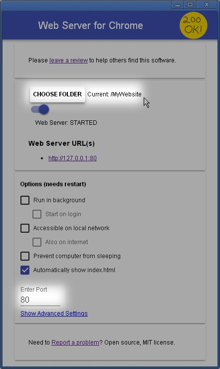

### Code organization & tests ###

#### Run all tests:
  * Firefox: [test.html](test.html) (just from the file system)
  * Chrome: [http://localhost/test.html](http://localhost/test.html) (requires local HTTP server, see below)

---
#### Code organization ####
Ultimately, we need a single piece of HTML that can be pasted into `MyWebsite` | `Einstellungen` | `Head bearbeiten`.
However, keeping it all in a single .html file - makes it essentially non-testable!

Hence we must organize things a bit more modular, and then some kind of rudimentary build process to put the pieces together.

The "build process" simply consists of [head.html](head.html) which pieces together all the javascript, and presents it in text box for copy&paste.
The required structure of MyWebsite's head insert so simple that it has just been hard-coded into [head.html](head.html).
The javascript sources reside under [src/js](src/js).

---

#### Third party ####

##### Framework: [QUnit](https://qunitjs.com) v2.6.1 #####
  * [lib/qunit-2.6.1.js](lib/qunit-2.6.1.js) from [code.jquery.com](https://code.jquery.com/qunit/qunit-2.6.1.js)
  * [lib/qunit-2.6.1.css](lib/qunit-2.6.1.css) from [code.jquery.com](https://code.jquery.com/qunit/qunit-2.6.1.css)

##### jQuery #####
1&1's MyWebsite basically uses [jQuery](https://jquery.com) v1.11.0, but not the pure jQuery core, it's rather a custom package with some plugins.
**TODO:** As yet, the exact dependencies which haven't all been resolved yet ("jimdoData"?). 

So: the code uses whatever is available under the global `jQuery` variable.
In the tests, we simply use the jQuery core.
Therefore - for now - the code must not use anything beyond the pure jQuery core.

Locally:

  * jQuery core 1.11.0, **currently used in tests (see above)**: [jquery-1.11.0.min.js](lib/jquery-1.11.0.min.js) from [code.jquery.com](https://code.jquery.com/jquery-1.11.0.min.js) 
  * 1&1 jQuery package: [lib/jquery-1.11.0.min+sizzle1.10.16.js]() from https://cdn.eu.mywebsite-editor.com/app/cdn/min/group/web.js

##### [RequireJS](https://requirejs.org) 1.0.7 #####

1&1's MyWebsite also uses RequireJS v1.0.7. They've packaged it up in one big file together with a whole lot of other stuff, e.g. a "jQuery JSON Plugin version: 2.3 (2011-09-17)" by Brantley Harris, or a "Simple javascript inheritance class" etc.

This large file is served from [https://cdn.eu.mywebsite-editor.com/proxy/apps/static/resource/dependencies/](https://cdn.eu.mywebsite-editor.com/proxy/apps/static/resource/dependencies/). It's here: [lib/require-1.0.7+more.js](lib/require-1.0.7+more.js)

Original v1.0.7: [lib/require-1.0.7.js](lib/require-1.0.7.js)
from [github](https://github.com/requirejs/requirejs/blob/1.0.7/require.js)

Latest v2.3.5: [lib/require-2.3.5.min.js](lib/require-2.3.5.min.js)
from [requirejs.org](https://requirejs.org/docs/download.html)

---
#### Local HTTP server for Chrome ####
Chrome is more strict about which files can be loaded via Ajax than Firefox.
Firefox allows `file://` access from local files to other local files *as long as they're in the same directory or below*.
Chrome does not. 

There are many ways to set up a simple HTTP server is e.g. python's SimpleHttpServer.
The easiest one providing all we need is probably:

###### The Chrome extension "Web Server for Chrome" ######
* Get it [from the Chrome Web Store](https://chrome.google.com/webstore/detail/web-server-for-chrome/ofhbbkphhbklhfoeikjpcbhemlocgigb).
* Go to [chrome://extensions](chrome://extensions), then Details for "Web Server for Chrome", and create a shortcut
* double-click the shortcut to bring up the server's control panel
* Set the folder to where [this folder (MyWebsite/)](../MyWebsite) is on your disk.
* Set the port to 80 (standard HTTP)
* For the server's logs: go to [chrome://inspect/#extensions](chrome://inspect/#extensions), then "Web Server for Chrome"'s `inspect` link. This opens a Developer Tools window; logging simply goes to the console.

