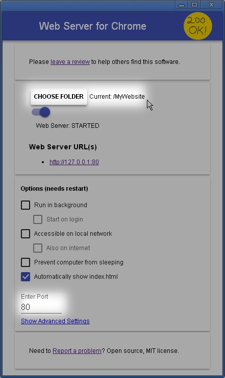

### Tests ###

#### Run all tests:
  * Firefox: [test.html](test.html) (just from the file system)
  * Chrome: [http://localhost/test.html](http://localhost/test.html) (must use local HTTP server, see below)

---

#### How it works ####
##### Framework: [QUnit](https://qunitjs.com) v2.6.1 #####
  * [lib/qunit-2.6.1.js](lib/qunit-2.6.1.js) from [code.jquery.com](https://code.jquery.com/qunit/qunit-2.6.1.js)
  * [lib/qunit-2.6.1.css](lib/qunit-2.6.1.css) from [code.jquery.com](https://code.jquery.com/qunit/qunit-2.6.1.css)

##### jQuery #####
1&1's MyWebsite basically uses [jQuery](https://jquery.com) v1.11.0, but not the pure jQuery core, it's rather a custom package with some plugins.
**TODO:** As yet, The exact dependencies which haven't all been resolved yet ("jimdoData"?). 

So: the code, uses whatever is available under the global `jQuery` variable.
In the tests, we simply use the jQuery core.
Therefore, and for now, the code must not use anything beyond the pure jQuery core.

The tests (and code) also use , since that's what is available on the website hosted by 1&1.
However, 
Unfortunately this exact package has 

Locally:

  * jQuery core 1.11.0, **currently used in tests (see above)**: [jquery-1.11.0.min.js](lib/jquery-1.11.0.min.js) from [code.jquery.com](https://code.jquery.com/jquery-1.11.0.min.js) 
  * 1&1 jQuery package: [lib/jquery-1.11.0.min+sizzle1.10.16.js]() from https://cdn.eu.mywebsite-editor.com/app/cdn/min/group/web.js

---
#### Local HTTP server for Chrome ####
Chrome is more strict about which files can be loaded via Ajax than Firefox.
Firefox allows `file://` access from local files to other local files *as long as they're in the same directory or below*.
Chrome does not. 
##### "Web Server for Chrome" #####
One (of many) way to set up a simple HTTP server is e.g. python's SimpleHttpServer.
Another one, even more easily set up is:

###### The Chrome extension "Web Server for Chrome" ######
* Get it [from the Chrome Web Store](https://chrome.google.com/webstore/detail/web-server-for-chrome/ofhbbkphhbklhfoeikjpcbhemlocgigb/related).
* Go to [chrome://extensions](chrome://extensions), then Details for "Web Server for Chrome", and create a shortcut
* double-click the shortcut to bring up the server's control panel
* Set the folder to where [this folder (MyWebsite/)](../MyWebsite) is on your disk.
* Set the port to 80 (standard HTTP)
* For the server's logs: go to [chrome://inspect/#extensions](chrome://inspect/#extensions), then "Web Server for Chrome"'s `inspect` link. This opens a Developer Tools window, logging simply goes to the console.

